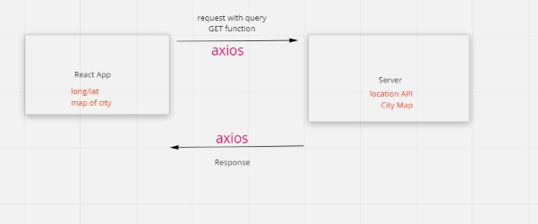

# City Explorer

**Author**: Lauren Main
**Version**: 1.0.0

## Overview
[View my Live site at netlify](https://laurenmainportfolio.netlify.app/)
Users of City Explorer, will be able to enter the name of a location so that I can see the exact latitude and longitude of that location, see a map of the city, clear error messages if something goes wrong, see weather infromation for the location, and finally see movies related to the locations that I searched.  

## Getting Started
<!-- What are the steps that a user must take in order to build this app on their own machine and get it running? -->

## Architecture
JavaScript, React, Bootstrap, Node.js

## Change Log
<ul>
<li>Initial setup: 8/2/2022</li>
<li>
<li>
<li>
<li>
</ul>

## Credit and Collaborations
Collaboration with Monika Davies

## Whiteboard of WRRC

## Features for Lab 06

Name of feature: Locations

Estimate of time needed to complete: 120 minutes

Start time: 10:30pm-11:10pm

Finish time: _____

Actual time needed to complete: _____

################################################################

Name of feature: Map

Estimate of time needed to complete: 120 minutes

Start time: _____

Finish time: _____

Actual time needed to complete: _____

################################################################

Name of feature: Errors

Estimate of time needed to complete: 120 minutes

Start time: _____

Finish time: _____

Actual time needed to complete: _____

## Whiteboard of WRRC

## Features for Lab 07

## Whiteboard of WRRC

## Features for Lab 08

## Whiteboard of WRRC

## Features for Lab 09

## Whiteboard of WRRC

## Features for Lab 10
