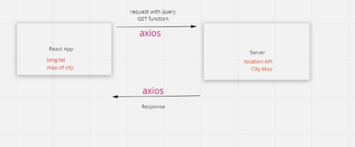
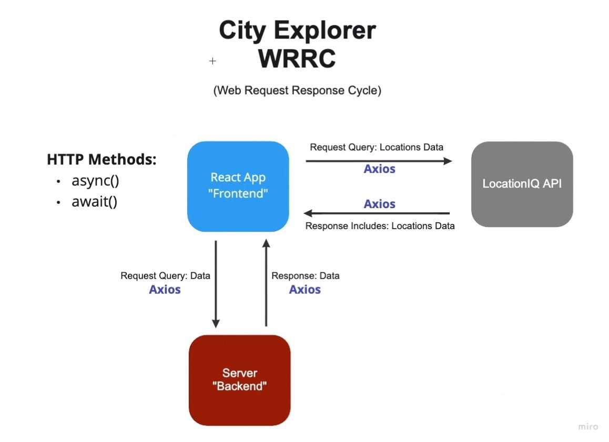
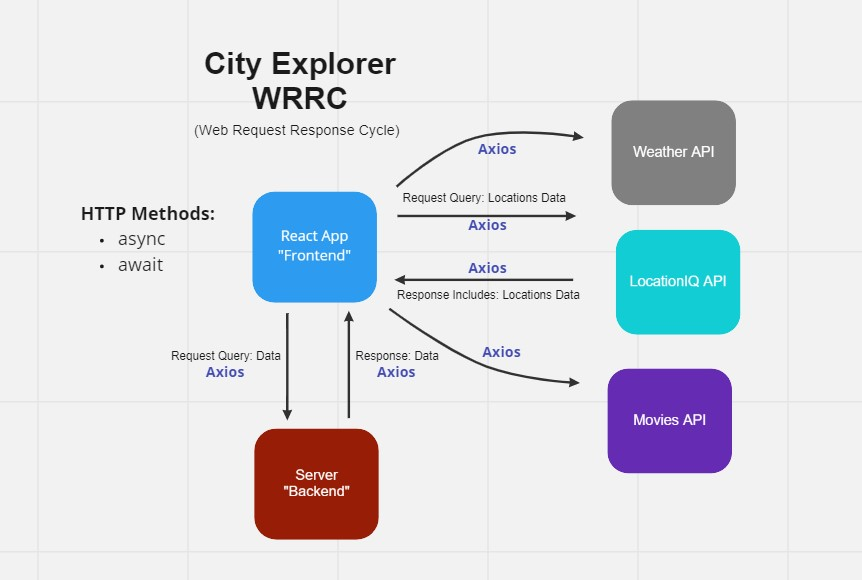
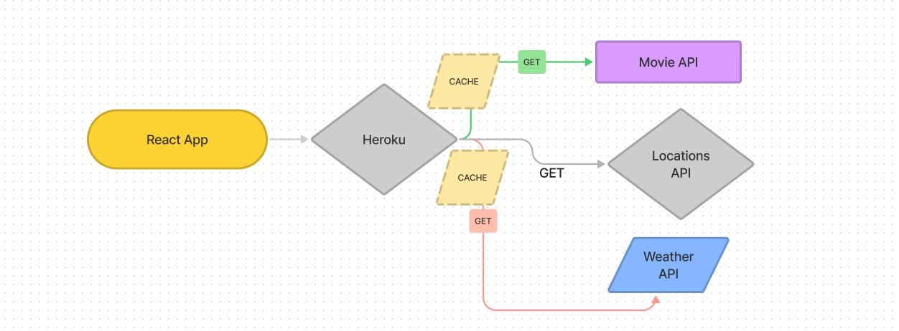

# City Explorer

**Author**: Lauren Main
**Version**: 1.0.11

## Overview
[View my Live site at netlify](https://elleemcityexplorer.netlify.app/) 
Users of City Explorer, will be able to enter the name of a location so that they can see the exact latitude and longitude of that location, see a map of the city, clear error messages if something goes wrong, see weather infromation for the location, and finally see movies related to the locations that I searched.  

## Getting Started
[Check out the Code Fellows guide here](https://trello.com/b/SCR1ag4c/city-explorer)

## Architecture
JavaScript, React, Bootstrap, Node.js

## Change Log
<ul>
<li>Initial setup: 8/2/2022</li>
<li> Locations API added with lon/lat 8/3/2022</li>
<li> Error message component added 8/4/2022 </li>
<li> Server added 8/6/2022</li>
<li> Movie and Weather APIs added 8/11/2022 </li>
<li> Deployed to Heroku 8/11/2022
<li> Refactors into modules and components 8/15/2022 </li>
<li> Add cache 8/17/2022 </li>
</ul>

## Credit and Collaborations
Collaboration with Monika Davies

## Whiteboard of WRRC

## Features for Lab 06

Name of feature: Locations

Estimate of time needed to complete: 120 minutes

Start time: 10:30pm-11:10pm and 5:30pm to 6:15pm 

Finish time: 6:15pm

Actual time needed to complete: 85 minutes

################################################################

Name of feature: Map

Estimate of time needed to complete: 120 minutes

Start time: 9:30pm

Finish time: 10:30pm

Actual time needed to complete: 60 minutes

################################################################

Name of feature: Errors

Estimate of time needed to complete: 120 minutes

Start time: 8:25pm to 9:30pm, 8:30pm to 9:30pm

Finish time: 9:30pm

Actual time needed to complete: 115 minutes

## Credit and Collaborations
Collaboration with Alejandro Rivera

## Whiteboard of WRRC

## Features for Lab 07

Name of feature: Weather

Estimate of time needed to complete: 120 minutes

Start time: 2:45pm to 5:00pm 9:30pm to 9:45pm 

Finish time: 5:00pm

Actual time needed to complete: 135 minutes

################################################################

Name of feature: Errors

Estimate of time needed to complete: 120 minutes

Start time: 5:00pm

Finish time: 5:30pm 

Actual time needed to complete: 30 minutes

################################################################

## Whiteboard of WRRC
Collaboration with Alejandro Rivera

## Features for Lab 08

Name of feature: Call from weather API

Estimate of time needed to complete: 120 minutes

Start time: 7:00pm

Finish time: 10:00pm

Actual time needed to complete: 180 minutes

################################################################

Name of feature: Call from movie API

Estimate of time needed to complete: 120 minutes

Start time: 3:00pm 

Finish time: 6:00pm

Actual time needed to complete: 180 minutes

################################################################

Name of feature: Deploy to Heroku

Estimate of time needed to complete: 120 minutes

Start time: 9:45pm

Finish time: 10:15pm

Actual time needed to complete: about 30 minutes, over a couple of sessions

################################################################

## Whiteboard of WRRC
Collaboration with Alejandro Rivera

## Features for Lab 09

Name of feature: Refactor backend

Estimate of time needed to complete: 120 minutes

Start time: 3:00pm

Finish time: 3:30pm

Actual time needed to complete: 30 minutes

################################################################

Name of feature: Refactor frontend

Estimate of time needed to complete: 120 minutes

Start time: 3:45pm to 6:00pm and 1:30pm to 2:45pm

Finish time: 2:45pm

Actual time needed to complete: 210 minutes

################################################################

## Whiteboard of WRRC
Collaboration with Lauren Main

## Features for Lab 10

Name of feature: Add Cache

Estimate of time needed to complete: 120 minutes

Start time: 6:45pm

Finish time: 8:30pm

Actual time needed to complete: 105 minutes

################################################################
